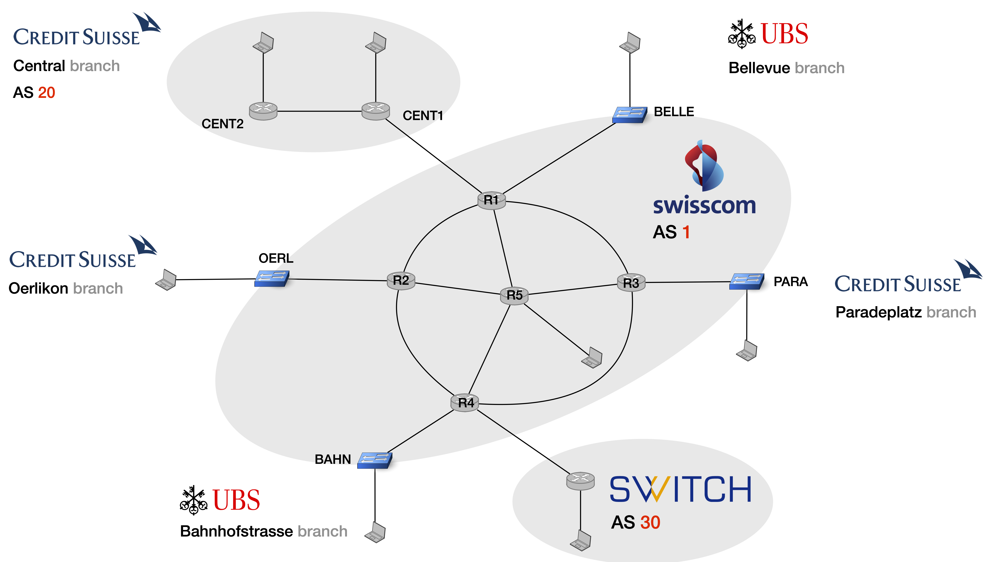
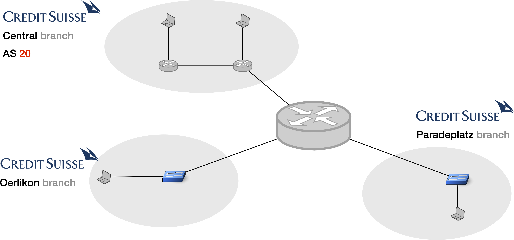
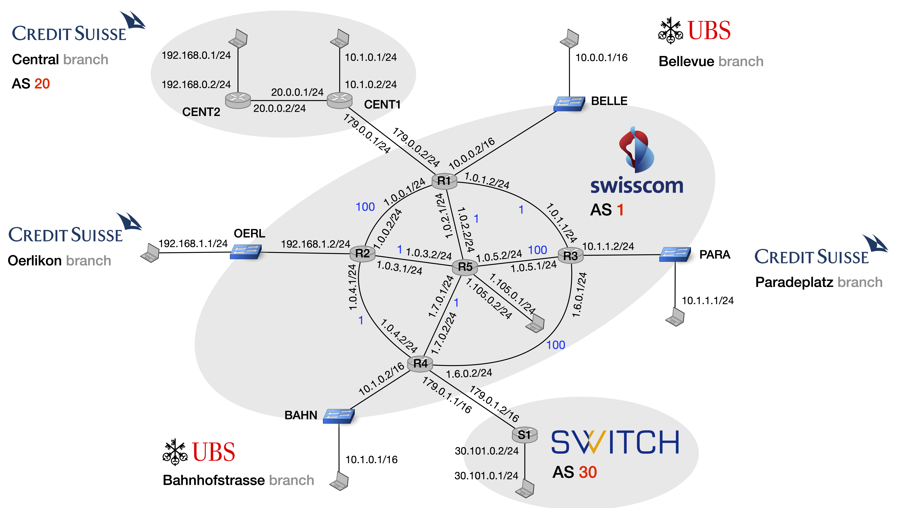

# BGP Free Core + BGP VPN over MPLS

In this exercise we will work with the mini-Internet, a virtual network mimicking the real Internet.


## Introduction

In this exercise, you will first set up a network with a BGP-free core using MPLS. Then, you will use this network to transparently connect other networks using Virtual Routing and Forwarding (VRF).
All this is done using the mini-Internet.
Let's have a look at the network topology before we detail your tasks.

### The Network

The network uses the following topology:



Swisscom (AS1 in the middle) is providing L3 connectivity between the SWITCH network as well as different branches of two Swiss banks: Credit Suisse and UBS.
UBS has two sites, one at Bellevue and one at Bahnhofstrasse, and each is connected to Swisscom via a L2 switch. Credit Suisse has three branches,
one at Paradeplatz, one at Oerlikon and the last branch is the Central branch with all the main offices. The branches at Oerlikon and
Paradeplatz are connected via L2 switches whereas the Central branch has its own L3 network (AS20) and peers with Swisscom using BGP.
Finally, Swisscom is also connected to SWITCH (AS 30) via an L3 router.


### Goals

The goal is to configure the routers such that Swisscom virtually interconnects the different sites of the same bank together. Of course, the different sites of Credit Suisse (resp. UBS) should _only_ be able to reach each other, and should be isolated from their competitor. For example, from the perspective of Credit Suisse, the network should look like this:



You will have to configure the routers in the Swisscom network such that Swisscom can offer MPLS-based L3VPN services using BGP. In addition, Swisscom should also provide basic L3 connectivity via BGP to the network of the central branch of the Credit Suisse bank as well as to the SWITCH network.


### Challenges

The main challenges you will have to overcome in this exercise (and more generally whenever one wants to offer a L3VPN service) are the following:

- **Reachability**: the internal prefixes used within a bank must be reachable from all the sites of the bank, as if the sites were directly connected. However, all the public prefixes must still be reachable from the entire internet, e.g. the public prefixes from Credit Suisse and SWITCH.
- **Isolation**: two sites from two distinct banks must not reach each other (even if both use the _same_ address space, e.g. `192.168.0.0/16`). Additionally, not all sites of the same bank should be connected. For example, the Oerlikon and Paradeplatz branch of Credit Suisse should both reach the Central branch, but not each other.
- **Scalability**: the Swisscom network should not be overloaded (both at the data and control plane level) and use MPLS for scalability.


## A mini-introduction to the  mini-Internet

In a nutshell, the mini-Internet is a virtual network mimicking the real Internet. Among others, there are routers, switches and hosts that are located in different Autonomous Systems (ASes). Each component of the network is running in its own dedicated docker container and can be accessed with a simple command.

The directory `mini_internet_project` in your home directory is a clone of the mini-Internet [repository](https://github.com/nsg-ethz/mini_internet_project).
It contains the scripts to build and clean up the mini-Internet as well as the config files that define the topology.
To simplify your life, you won't have to do anything in the `mini_internet_project` directory, instead we provide you with easy-to-use scripts and tools that can run or and manage the mini-Internet.

### Overview

- [How does it work?](#how-does-it-work)
- [Build the mini-Internet](#build-the-mini-internet)
- [Access the virtual devices](#access-the-virtual-devices)
- [Configure the virtual devices](#configure-the-virtual-devices)


### How does it work?

The mini-Internet is a virtual network that mimics the Internet and can run on a single computer (or a VM). It consists of virtual devices which run in their own dedicated [docker containers](https://www.docker.com/resources/what-container). The containers are interconnected with virtual links to form the virtual network. The topology of the mini-Internet can be specified in configuration files.

A virtual device can either be a router, a switch or a host. For the routers, we use [FRRouting](https://frrouting.org/), a well-known software suite that provides a CLI similar to the one provided by actual IP routers. For the switches, we use [Open vSwitch](https://www.openvswitch.org/), a popular software switch often used in production. Finally, the hosts are Linux hosts running Debian Stretch.

Below, we describe how you can build and configure the network and virtual devices.

### Build the mini-Internet

To build your mini-Internet, you simply have to run [`./build/build.sh`](build/build.sh).
This script also cleans up the mini-Internet that was running before (if any). Verify that the mini-Internet is running with the command `sudo docker ps`, which lists all running containers. Here is snapshot of what you should see:

```
thomas@pc-10328:~$ docker ps
CONTAINER ID        IMAGE               COMMAND                  CREATED             STATUS              PORTS               NAMES
b1ce11c8109b        thomahol/d_host     "/usr/sbin/docker-st…"   20 hours ago        Up 20 hours                             30_S1host
73c5af7e49a9        thomahol/d_router   "/usr/sbin/docker-st…"   20 hours ago        Up 20 hours                             30_S1router
fa94c09c27a8        thomahol/d_ssh      "/usr/sbin/docker-st…"   20 hours ago        Up 20 hours                             30_ssh
efb000eef324        thomahol/d_host     "/usr/sbin/docker-st…"   20 hours ago        Up 20 hours                             20_CENT2host
07ef462b8b4b        thomahol/d_router   "/usr/sbin/docker-st…"   20 hours ago        Up 20 hours                             20_CENT2router
...
```

:information_source: This command only shows running containers. To include stopped or crashed containers, use `sudo docker ps -a`.

#### Manual Clean-up

In case you just want to clean-up the mini-Internet without building a new one, you can run the script [`./build/cleanup.sh`](build/cleanup.sh).

### Access the virtual devices

There are two ways to access the virtual devices. We explain each of them in the following subsections.

#### Access with a simple script

You can use  the script [`./access.sh`](access.sh) to access the hosts and routers in the network.
As a parameter, provide the name of the device you would like to access.
For instance, if you want to access the CLI of the router `R4`, you can run `./access.sh R4`. If you want to access the host connected to the switch `OERL`, then you can run `./access.sh OERL-host`. To leave, just type `exit` or press `CTRL+D`.

By default, the script opens the virtual terminal `vtysh` for routers, and `bash` for hosts.
You can also provide other commands, e.g. `./access R1 bash` to open `bash` on `R1` instead of `vtysh`.

:information_source: you can't access any switches with this script, as they do not offer a CLI. But don't worry, they are already configured to forward packets as we need.

#### Access with docker commands

As explained above, each virtual device runs in a dedicated docker container.
Docker provides commands to access containers, and our access script is in fact just a small wrapper around these docker commands to save you some typing.
Instead of using our script, you can always issue the underlying docker commands yourself.
To access the CLI of a router, you can write `sudo docker exec -it 1_R1router vtysh`. To access the host connected to the switch PARA, you can write `sudo docker exec -it 1_L2_CS2_para_host bash`. You can see the name of each container with the command `sudo docker ps`.

### Configure the virtual devices

In this exercise, you will have to configure _only_ the routers. Switches are pre-configured when the mini-Internet is built, and we also provide the host configuration.

#### Load the default configuration

We provide default router configuration, in which the IP addresses as well as OSPF are already configured. In the default configuration of a host, the IP address is configured as well as the default gateway.
You can find the default configurations in the directory `build/default_config`. There is one file for each router and host. For instance, the file [`build/default_config/R1.sh`](build/default_config/R1.sh) shows the default configuration for the router R1.

The default configuration is automatically loaded when building the mini-Internet.

#### Using the Command Line Interface (CLI)

After loading the default configuration, you need to configure the routers. The first way to configure the routers is through their CLI. Please look at **Section 5** of the mini-Internet [tutorial][tutorial] from our Communication Networks lecture for a short introduction. Some of the most important commands are `conf t` to enter configuration mode (you can abbreviate commands; this one stands for `configure terminal`), which you can leave with `exit`; and `show run` to show the complete configuration.

[tutorial]: https://github.com/nsg-ethz/mini_internet_project/blob/master/communication_networks_course/2020_assignment_eth/tutorial.pdf

#### Configure using scripts

Another way to configure the routers is via scripts, and we have prepared an easy way for you to do this. You can write your commands into the files in the directory `config/`. There is one file for each router.
To execute all these scripts and send the commands to the routers, you simply need to run `./config/configure.sh`.

:warning: Running the script `./config/configure.sh` will not erase the previous configuration.

#### Save your Configuration

We recommend to regularly save your configuration. For instance, when you configure something new, you can add it into the config scripts. Then, when you build the mini-Internet, you can quickly load the latest configuration by running `./config/configure.sh`.
Additionally, when you type `write` in the CLI of a router, the running configuration is saved in the file `/etc/frr/frr.conf` (in the container of the router). As a shortcut for this, you can run `./config/save_configs.sh`, which saves the running configuration of all routers and copies the resulting files into the directory `config/saved_configs`.

#### Debug with tcpdump

To verify that your configuration works properly, you may want to run `tcpdump` on some interfaces. For instance, this could help you to verify the MPLS labels that are used in each packet. To do that, you can access the docker container of a router with `docker exec -it 1_R1router bash` (here for router R1). Observe that we run `bash` now instead of `vtysh` (which is used to directly access the CLI of the router). Once in the docker container, you can list the interfaces with `ifconfig`, and you can run a `tcpdump` on one of them with e.g., `tcpdump -i port_R2 -n` (the `-n` option tells `tcpdump` not to convert IP addresses into names).
You can also use the `./access.sh` as a shortcut, e.g. `./access.sh R1 tcpdump -i port_R2 -n`.


## Exercise Overview

To save you some time, the default configuration files already configure the IP addresses as well as OSPF for you. The following figure shows the IP address for each interface as well as the OSPF link weights inside AS 1.



In addition to the interfaces shown above, we configured a loopback interface `lo` for each router in AS 1, using the address `1.15X.0.1/32`, where `X` is the router id, e.g. `1.151.0.1/32` for router `R1`.

Since the OSPF and the IP addresses are already configured, the routers in AS 1 are already connected and can ping/traceroute/etc. each other.
For instance, this is the output of a traceroute from R1 to R4:

```
R1_router# traceroute 1.154.0.1
traceroute to 1.154.0.1 (1.154.0.1), 64 hops max
  1   1.0.2.2  0.244ms  0.236ms  0.250ms
  2   1.154.0.1  0.480ms  0.459ms  0.458ms
```

Now it is up to you to solve the challenges above by following the tasks below.

  - [Task 1: Configure BGP and a BGP Free Core](#task-1-configure-bgp-and-a-bgp-free-core)
    - [Configure the iBGP sessions](#configure-the-ibgp-sessions)
    - [Configure the eBGP sessions](#configure-the-ebgp-sessions)
    - [Configure MPLS forwarding with LDP](#configure-mpls-forwarding-with-ldp)
  - [Task 2: Configure the VPN over BGP using VRF](#task-2-configure-the-vpn-over-bgp-using-vrf)
    - [Configuring eBGP in a VRF](#configuring-ebgp-in-a-vrf)
    - [Configure the VPNs](#configure-the-vpns)
  - [Task 3: Configure advanced routing policies](#task-3-configure-advanced-routing-policies)
    - [Configure routing policies between the Credit Suisse sites](#configure-routing-policies-between-the-credit-suisse-sites)
    - [Configure routing for external prefixes in the Swisscom network](#configure-routing-for-external-prefixes-in-the-swisscom-network)

## Task 1: Configure BGP and a BGP Free Core

### Configure the iBGP sessions

The first step is to configure the iBGP sessions between the routers in the Swisscom network so that the external routes learned via the eBGP sessions are distributed internally and then announced to the other ASes connected to the Swisscom network.
Below, you can find the commands to configure iBGP for the router `R4`.
In particular, you need to use the `next-hop-self` as well as the `update-source` commands and make sure to use the loopback interface address for each neighbor. Remember to check the [tutorial][tutorial] if you need to look up any commands.

```
conf t
router bgp 1
neighbor 1.151.0.1 remote-as 1
neighbor 1.151.0.1 update-source lo
neighbor 1.152.0.1 remote-as 1
neighbor 1.152.0.1 update-source lo
neighbor 1.153.0.1 remote-as 1
neighbor 1.153.0.1 update-source lo
address-family ipv4 unicast
network 1.0.0.0/8
neighbor 1.151.0.1 next-hop-self
neighbor 1.152.0.1 next-hop-self
neighbor 1.153.0.1 next-hop-self
exit
exit
exit
```

:information_source: Some BGP settings are per-session, e.g. which neighbors exist. Other settings are related to the BGP advertisements. These settings can be different for each address-family, e.g. IPv4 and IPv6. For that reason, we need to first enter `address-family ipv4 unicast` before we can specify `network` and `next-hop-self`! In tasks 2 and 3 you will see some other families, but for now just use `ipv4 unicast`.

Importantly, do **not** configure an iBGP full mesh.
We are going to set up a BGP free core; only border routers are running BGP.
This means that you have to configure the iBGP sessions between R1, R2, R3 and R4 but **not** R5.

You can verify that the connections are up with the command `sh ip bgp summary` in any router:

```
R4_router# sh ip bgp summary

IPv4 Unicast Summary:
BGP router identifier 1.154.0.1, local AS number 1 vrf-id 0
BGP table version 2
RIB entries 3, using 552 bytes of memory
Peers 4, using 82 KiB of memory

Neighbor        V         AS MsgRcvd MsgSent   TblVer  InQ OutQ  Up/Down State/PfxRcd
1.151.0.1       4          1       4       5        0    0    0 00:00:06            1
1.152.0.1       4          1       4       5        0    0    0 00:00:07            1
1.153.0.1       4          1       4       5        0    0    0 00:00:06            1
```

### Configure the eBGP sessions

Now that iBGP is configured, we need to connect AS 1 to its neighbor, AS 30. For now, do not worry about the eBGP session with AS 20, we'll get to that later.
Configuring eBGP is much like iBGP, with one important difference:
By default, the latest versions of FRR drop all external traffic.
Thus, we need to define a default route-map that accepts everything, or the router will neither advertise nor distribute anything received via eBGP. In addition, `next-hop-self` and `update-source` are set automatically for eBGP and you can skip them.

For instance, this is how you would configure router `S1` in AS 30.
Do not forget to set up the eBGP sessions in the router `R4` as well.

```
conf t
route-map ACCEPT permit 10
exit
router bgp 30
neighbor 179.0.1.1 remote-as 1
address-family ipv4 unicast
network 30.0.0.0/8
neighbor 179.0.1.1 route-map ACCEPT in
neighbor 179.0.1.1 route-map ACCEPT out
exit
exit
```

Verify that the session is up with `sh ip bgp summary`. If the session is up and the route maps are correct, you should see the route on every router in the Swisscom network connected to `R4` with iBGP sessions. For instance, here is what you should see on router `R1` if you run a `sh ip bgp`:

```
R1_router# sh ip bgp
BGP table version is 4, local router ID is 1.151.0.1, vrf id 0
Default local pref 100, local AS 1
Status codes:  s suppressed, d damped, h history, * valid, > best, = multipath,
               i internal, r RIB-failure, S Stale, R Removed
Nexthop codes: @NNN nexthop's vrf id, < announce-nh-self
Origin codes:  i - IGP, e - EGP, ? - incomplete

   Network          Next Hop            Metric LocPrf Weight Path
* i1.0.0.0/8        1.154.0.1                0    100      0 i
* i                 1.153.0.1                0    100      0 i
* i                 1.152.0.1                0    100      0 i
*>                  0.0.0.0                  0         32768 i
*>i30.0.0.0/8       1.154.0.1                0    100      0 30 i
```

Great! However, remember that we have not configured an iBGP full mesh.
While `R1` knows about the SWITCH prefix `30.0.0.0/8`, you won't be able to actually reach anything in AS 30. For example let's try to ping `S1-host`.

```
R1_router# ping 30.101.0.1
PING 30.101.0.1 (30.101.0.1) 56(84) bytes of data.
From 1.0.2.2 icmp_seq=1 Destination Net Unreachable
```

As you can see, the shortest path to AS 30 goes over `R5`, our BGP-free core.
We have (intentionally) not set up any iBGP sessions on `R5`, so it does not know how to reach the prefix `30.0.0.0/8`, which it reports back to `R1` (`Destination Net Unreachable`).

In the next part, we will fix this by configuring LDP to forward traffic using MPLS in the Swisscom network.

### Configure MPLS forwarding with LDP

We must configure LDP on each router in the Swisscom network.
You can find more information about how LDP works in the lecture.
In this FRR documentation [page](http://docs.frrouting.org/en/latest/ldpd.html), you can find how to configure LDP.

:information_source: When you need an address to identify the router or the transport-address, use the loopback address!


Once LDP is configured on all the routers, you can use `show mpls ldp neighbor` to verify that the LDP connections are established with all neighbors.
Then, you can take a look at the binding obtained through the MPLS exchange with LDP using `show mpls ldp binding`. For instance:

```
R1_router# show mpls ldp binding
AF   Destination          Nexthop         Local Label Remote Label  In Use
ipv4 1.151.0.1/32         1.153.0.1       imp-null    16                no
ipv4 1.151.0.1/32         1.155.0.1       imp-null    16                no
ipv4 1.152.0.1/32         1.153.0.1       16          17                no
ipv4 1.152.0.1/32         1.155.0.1       16          17               yes
ipv4 1.153.0.1/32         1.153.0.1       17          imp-null         yes
ipv4 1.153.0.1/32         1.155.0.1       17          18                no
ipv4 1.154.0.1/32         1.153.0.1       18          18                no
ipv4 1.154.0.1/32         1.155.0.1       18          19               yes
ipv4 1.155.0.1/32         1.153.0.1       19          19                no
ipv4 1.155.0.1/32         1.155.0.1       19          imp-null         yes
ipv4 158.1.0.0/16         1.153.0.1       imp-null    imp-null          no
ipv4 158.1.0.0/16         1.155.0.1       imp-null    imp-null          no
```

You can also look at the MPLS table (LFIB) using `show mpls table`:

```
R1_router# show mpls table
 Inbound Label  Type  Nexthop  Outbound Label
 ----------------------------------------------
 16             LDP   1.0.2.2  17
 17             LDP   1.0.1.2  implicit-null
 18             LDP   1.0.2.2  19
 19             LDP   1.0.2.2  implicit-null
 4294967295     LDP   1.0.2.2  implicit-null
 4294967295     LDP   1.0.1.2  implicit-null
 4294967295     LDP   0.0.0.0  implicit-null
```

Now, let's ping from `S1-host` from `R1` again:

```
R1_router# ping 30.101.0.1
PING 30.101.0.1 (30.101.0.1) 56(84) bytes of data.
64 bytes from 30.101.0.1: icmp_seq=1 ttl=61 time=1.38 ms
...
```

It works! We can also run a traceroute:

```
R1_router# traceroute 30.101.0.1
traceroute to 1.151.0.1 (1.151.0.1), 30 hops max, 60 byte packets
 1  * * *
 2  1.0.7.2  0.551ms  0.560ms  0.489ms
 3  179.0.1.2  1.002ms  0.708ms  0.726ms
 4  30.101.0.1  0.888ms  0.731ms  0.722ms
```

It works too! And you can see that the first hop is hidden, as the packet is in an MPLS tunnel between `R1` and `R4`.


## Task 2: Configure the VPN over BGP using VRF

Now that the BGP free core is configured and that the Swisscom network can forward traffic between its neighbors, it is time to configure the VPNs such that Credit Suisse and UBS can _only_ talk to each other. Note that Swisscom has two types of connection to neighboring sites: the central branch of Credit Suisse is connected to Swisscom via BGP whereas the other branches are directly connected via a L2 switch (both of these connections do occur in practice).
For this, we will use VRF.

In order to use VRF, the router interfaces (in AS 1) connected to a bank site need to be assigned to a particular VRF.
FRRouting builds on Linux VRF, and the VRF interfaces need to be created in Linux before we can configure them in FRRouting. For your convenience, this is automatically done in the default configuration when building the mini-Internet,
so you do not have to worry about configuring them correctly.

You can see a list of the interfaces in the `default` VRF with the command `show interface brief`.
To show interfaces in other VRFs, you need to use the command `show interface vrf VRF_NAME brief`, where you can either enter a specific VRF, or use `all`.
For example, this is the output for `show interface vrf all brief` on `R1`:


```
R1_router# show interface vrf all brief
Interface       Status  VRF             Addresses
---------       ------  ---             ---------
VRF_CS          up      VRF_CS          
ext_20_CENT1    up      VRF_CS          179.0.0.2/24

Interface       Status  VRF             Addresses
---------       ------  ---             ---------
R1-L2           up      VRF_UBS         10.0.0.2/16
VRF_UBS         up      VRF_UBS         

Interface       Status  VRF             Addresses
---------       ------  ---             ---------
lo              up      default         1.151.0.1/32
port_R2         up      default         1.0.0.1/24
port_R3         up      default         1.0.1.1/24
port_R5         up      default         1.0.2.1/24
ssh             up      default         158.1.10.1/16
```

As you can see, we will use two VRFs in this exercise: `VRF_CS` for Credit Suisse and `VRF_UBS` for UBS.
Let's have a closer look at `VRF_CS` using `show interface vrf VRF_CS`:

```
R1_router# show interface vrf VRF_CS brief
Interface       Status  VRF             Addresses
---------       ------  ---             ---------
VRF_CS          up      VRF_CS
ext_20_CENT1    up      VRF_CS          179.0.0.2/24
```

The first entry is the virtual interface used by the VRF, you do not have to use it. The second interface is the interface of the router connected to the router `CENT1` in AS20.

:information_source: You might notice that you cannot ping `CENT1` (`179.0.0.1`) from `R1`, as this address is not known outside the VRF. Unfortunately, it is currently impossible to specify the VRF interface as a ping source with the `ping` command in `vtysh`, but it is possible with the Linux `ping`, e.g. using `./access.sh R1 ping -I ext_20_CENT1 179.0.0.1`.


### Configuring eBGP in a VRF

Your first step is to configure eBGP between Swisscom and the central branch of Credit Suisse (AS20).
Important, you have to run the BGP session in the VRF `VRF_CS`.
To do that, use the command `router bgp 1 vrf VRF_CS` when configuring this BGP session on `R1`.
You can find more information on how to configure BGP in a VRF in [the FRR docs](http://docs.frrouting.org/en/latest/bgp.html).
Do not forget that you also need to configure the session in the router `CENT1`.
You do not need to specify a `VRF` in `CENT1`. Can you explain why?

In AS20, i.e. router `CENT1`, you should not only advertise the public prefix of Credit Suisse (`20.0.0.0/8`), but _also_ the internal prefixes (`192.168.0.1/24` and `10.1.0.0/24`). Using VRF, Swisscom can ensure that the internal prefixes of Credit Suisse are only advertised to other sites of Credit Suisse. We will get to that later.

When you have configured the eBGP session between Swisscom and AS20, Swisscom will learn prefixes from AS20.
However, these prefixes will be in the VRF routing table for `VRF_CS`, and not in the `default` routing table. Thus, the prefix of AS20 (`20.0.0.0/8`) will not be reachable from the default VRF in the Swisscom network. You can verify this with `sh ip bgp summary` and `sh ip bgp` on R1:

```
R1_router# sh ip bgp summary

IPv4 Unicast Summary:
BGP router identifier 1.151.0.1, local AS number 1 vrf-id 0
BGP table version 8
RIB entries 3, using 552 bytes of memory
Peers 3, using 61 KiB of memory

Neighbor        V         AS MsgRcvd MsgSent   TblVer  InQ OutQ  Up/Down State/PfxRcd
1.152.0.1       4          1      22      34        0    0    0 00:08:09            1
1.153.0.1       4          1      28      47        0    0    0 00:08:09            1
1.154.0.1       4          1      30      42        0    0    0 00:08:10            2
```

```
R1_router# sh ip bgp
BGP table version is 8, local router ID is 1.151.0.1, vrf id 0
Default local pref 100, local AS 1

   Network          Next Hop            Metric LocPrf Weight Path
* i1.0.0.0/8        1.152.0.1                0    100      0 i
* i                 1.153.0.1                0    100      0 i
* i                 1.154.0.1                0    100      0 i
*>                  0.0.0.0                  0         32768 i
*>i30.0.0.0/8       1.154.0.1                0    100      0 30 i
```

As you can see, neither the peer `179.0.0.1` nor the prefix `20.0.0.0/8` appear in this list. BGP sessions in different VRFs (here `default` and `VRF_CS`), and all advertised/received prefixes, are completely separated.
To see the BGP information for `VRF_CS`, you can use  `sh ip bgp vrf VRF_CS summary` and `sh ip bgp vrf VRF_CS`:

```
R1_router# sh ip bgp vrf VRF_CS summary

IPv4 Unicast Summary:
BGP router identifier 179.0.0.2, local AS number 1 vrf-id 2
BGP table version 12
RIB entries 11, using 2024 bytes of memory
Peers 1, using 20 KiB of memory

Neighbor        V         AS MsgRcvd MsgSent   TblVer  InQ OutQ  Up/Down State/PfxRcd
179.0.0.1       4         20      27      26        0    0    0 00:12:36            3

Total number of neighbors 1
```
```
R1_router# sh ip bgp vrf VRF_CS
BGP table version is 14, local router ID is 179.0.0.2, vrf id 2
Default local pref 100, local AS 1

   Network          Next Hop            Metric LocPrf Weight Path
*> 10.1.0.0/24      179.0.0.1                0             0 20 i
*> 20.0.0.0/8       179.0.0.1                0             0 20 i
*> 192.168.0.0/24   179.0.0.1                0             0 20 i

Displayed  4 routes and 4 total paths
```

You can see that the eBGP session with AS20 is established in the vrf `VRF_CS`, and that `R1` receives the three prefixes advertised by AS20.

:information_source: In order for AS20 to advertise the prefix `192.168.0.0/24` to `R1`, do not forget to configure the router `CENT2` so that it advertises that prefix to `CENT1` via iBGP.

### Configure the VPNs

To maintain separation between traffic from the different banks, we will now configure BGP VPNs over MPLS.

1.  We need to enable the BGP VPN sessions between the different routers using the `vpn` [address-family](http://docs.frrouting.org/en/latest/bgp.html#address-families). Here is an example for the router `R1`, which has a BGP VPN connection with `R2`, `R3` and `R4`.

    ```
    address-family ipv4 vpn
    neighbor 1.152.0.1 activate
    neighbor 1.153.0.1 activate
    neighbor 1.154.0.1 activate
    ```

2. You need to enable BGP to advertise the prefixes over the VPN using MPLS. You can do that using the command [`label vpn export auto`](http://docs.frrouting.org/en/latest/bgp.html#clicmd-labelvpnexport(0..1048575)|auto).
3. You must enable the [import and export](http://docs.frrouting.org/en/latest/bgp.html#clicmd-import|exportvpn) of the routes between the VRF and the VPN.
4. You need to configure a [_route distinguisher_](http://docs.frrouting.org/en/latest/bgp.html#clicmd-rdvpnexportAS:NN|IP:nn). You can use for instance `rd vpn export 192.168.1.0:1` in R2 to advertise the prefix `192.168.1.0` with the route distinguisher `1`. Note that you still need the command `network 192.168.1.0/24` in BGP for `VRF_CS` to advertise that prefix (you can also use `redistribute connected` in which case the command `rd vpn export 20:1` is enough to apply that route distinguisher to all advertised prefixes).
5. You need to configure a [_route target_](http://docs.frrouting.org/en/latest/bgp.html#clicmd-rtvpnimport|export|bothRTLIST...). For now, always use the same route target for import _and_ export for each VRF, so that the prefixes in one site are advertised to all the other sites of the same bank.

Now, we can run the command `sh ip bgp vrf VRF_CS` in the router `R3` to verify that the routes are correctly announced between the `VRF_CS` in `R3` and the `VRF_CS` in routers `R1` and `R2`.

```
R3_router# sh ip bgp vrf VRF_CS
BGP table version is 11, local router ID is 10.1.1.2, vrf id 2
Default local pref 100, local AS 1

   Network          Next Hop            Metric LocPrf Weight Path
*> 10.1.0.0/24      1.151.0.1@0<             0    100      0 20 i
*> 10.1.1.0/24      0.0.0.0                  0         32768 ?
*> 20.0.0.0/8       1.151.0.1@0<             0    100      0 20 i
*> 192.168.0.0/24   1.151.0.1@0<             0    100      0 20 i
*> 192.168.1.0/24   1.152.0.1@0<             0    100      0 ?

Displayed  5 routes and 5 total paths
```

And we can also run the command `show mpls table` to verify that the traffic between the different sites are indeed separated using MPLS labels.
Below is the output of that command in the router `R3`.

```
R3_router# show mpls table
 Inbound Label  Type  Nexthop  Outbound Label
 ----------------------------------------------
 16             LDP   1.0.1.1  implicit-null
 17             LDP   1.0.1.1  16
 18             LDP   1.0.1.1  18
 19             LDP   1.0.1.1  19
 80             BGP   VRF_CS   -
 4294967295     LDP   1.0.1.1  implicit-null
 4294967295     LDP   0.0.0.0  implicit-null
```

We can see that the label 80 is used for the BGP VPN for the `VRF_CS`. If you run a `tcpdump`, you will see that the packets going from the Oerlikon branch of Credit Suisse to the central branch of Credit Suisse are tagged with two MPLS labels within the Swisscom network. One is used for the forwarding within the Swisscom network (BGP free Core), and the other one is used for the BGP VPN.

Finally, you can verify that the connectivity is working fine by running `ping` and `traceroute`. For instance, Here is the output of a traceroute from the Credit Suisse branch at Oerlikon to the Credit Suisse branch at Paradeplatz. Do not forget to use the `-n` option when you run a traceroute from a host, so it does not try to translate IPs into domain names.

```
root@oerl_host:/# traceroute 10.1.1.1 -n
traceroute to 10.1.1.1 (10.1.1.1), 30 hops max, 60 byte packets
 1  * * *
 2  * * *
 3  * * *
 4  10.1.1.1  7.756 ms  7.706 ms  7.676 ms
```

The sites are connected, and hops 1 to 3 are hidden because of the MPLS tunnel in the Swisscom network.

## Task 3: Configure advanced routing policies

### Configure routing policies between the Credit Suisse sites

Until now, all Credit Suisse sites are interconnected.
However, Credit Suisse has asked Swisscom to add the following constraint:
The branches at Oerlikon and Paradeplatz should both be able to communicate with the Central branch (and the Central branch with them), but they should _not_ be able to communicate with each other.

It is your next task to implement this constraint.
You can achieve this by modifying the BGP configuration of some routers in AS1.
Concretely, you will have to use multiple different _route targets_ for each branch, and update your import/export rules accordingly.

When you have updated your configuration, you can verify your solution in multiple ways:
- You could check that the router `R2` does not receive the prefix `10.1.1.0/24` in the VRF `VRF_CS`.
- You could also verify that there is no connectivity with `ping` and `traceroute`.


### Configure routing for external prefixes in the Swisscom network

Besides providing L3VPN, Swisscom is also providing basic L3 connectivity to its customers. For instance, Credit Suisse owns the public prefix `20.0.0.0/8` and would like Swisscom to advertise it to the rest of the mini-Internet. Same for SWITCH, who would like its prefix `30.0.0.0/8` to be reachable by the other ASes in the mini-Internet.

**Goal**: configure the routers in the mini-Internet such that SWITCH and the central branch of Credit Suisse can talk to each other. Here, only the public prefixes (i.e., `20.0.0.0/8` for Credit Suisse and `30.0.0.0/8` for SWITCH) must be advertised in the mini-Internet.

**Challenge**: the interface in router `R1` connected to the central branch of Credit Suisse (AS20) is in the VRF `VRF_CS`. This leads to two problems:
1. `R1` learns the prefix `20.0.0.0/8` (advertised by AS20) in the vrf `VRF_CS`, and thus that prefix will not be advertised to `R2`, `R3` and `R4` via iBGP.
2.  The public prefix learnt by `R1` via iBGP (here only `30.0.0.0/8`) is in the `default` vrf only, and thus not advertised to `AS20`.

To solve these two problems, we will leak routes from the vrf `VRF_CS` to the `default` vrf and vice versa.
To do that you can use the capabilities provided by BGP VPN. You can `import` and `export` vpn routes in the bgp instance of the **`default`** vrf (i.e. in `router bgp 1`). More precisely:
- To leak routes from the vrf `VRF_CS` to the `default` vrf, you can  `import` routes with a route target equal to `20:1`.
- To leak routes from the `default` vrf to the vrf `VRF_CS`, you can `export` the routes with a route distinguisher and a route target equal to `1:1`. Then, in the bgp instance of the vrf `VRF_CS`, make sure to import the vpn routes with a route target equal to `1:1`.

:warning: By default, all the routes in the vrf `VRF_CS` are leaked into the `default` vrf. However, you can apply a route map on the BGP VPN routes with `route-map vpn import ROUTEMAP_NAME` which filters out all the private prefixes of Credit Suisse (namely `10.1.0.0/24` and `192.168.0.0/24`).

You can verify that the routes have been leaked by showing the bgp routes in the different vrfs. For instance
in the `default` VRF of `R1` we do see the prefix `20.0.0.0/8`.

```
R1_router# sh ip bgp
BGP table version is 3, local router ID is 1.151.0.1, vrf id 0
Default local pref 100, local AS 1

   Network          Next Hop            Metric LocPrf Weight Path
* i1.0.0.0/8        1.154.0.1                0    100      0 i
* i                 1.153.0.1                0    100      0 i
* i                 1.152.0.1                0    100      0 i
*>                  0.0.0.0                  0         32768 i
*  20.0.0.0/8       179.0.0.1@2              0             0 20 i
*>                  0.0.0.0                  0         32768 i
*>i30.0.0.0/8       1.154.0.1                0    100      0 30 i
```

and in the vrf `VRF_CS` we do see the prefix `30.0.0.0/8`.

```
R1_router# sh ip bgp vrf VRF_CS
BGP table version is 7, local router ID is 179.0.0.2, vrf id 2
Default local pref 100, local AS 1

   Network          Next Hop            Metric LocPrf Weight Path
*  1.0.0.0/8        1.154.0.1@0<             0    100      0 i
*                   1.153.0.1@0<             0    100      0 i
*                   1.152.0.1@0<             0    100      0 i
                    0.0.0.0@0<               0         32768 i
*>                  0.0.0.0                  0         32768 i
*> 10.1.0.0/24      179.0.0.1                0             0 20 i
*> 10.1.1.0/24      1.153.0.1@0<             0    100      0 ?
*> 20.0.0.0/8       179.0.0.1                0             0 20 i
                    0.0.0.0@0<               0         32768 i
*> 30.0.0.0/8       1.154.0.1@0<             0    100      0 30 i
*> 192.168.0.0/24   179.0.0.1                0             0 20 i
*> 192.168.1.0/24   1.152.0.1@0<             0    100      0 ?
```

You can also verify that the router `CENT1` receives the prefix `30.0.0.0/8` and
that the router `S1` receives the prefix `20.0.0.0/8`. To illustrate, here is a
the result of a `sh ip bgp` in the router `S1`, where we can see the prefix `20.0.0.0/8`.

```
S1_router# sh ip bgp
BGP table version is 3, local router ID is 179.0.1.2, vrf id 0
Default local pref 100, local AS 30

   Network          Next Hop            Metric LocPrf Weight Path
*> 1.0.0.0/8        179.0.1.1                0             0 1 i
*> 20.0.0.0/8       179.0.1.1                              0 1 i
*> 30.0.0.0/8       0.0.0.0                  0         32768 i
```

Finally, you should be able to `ping` and `traceroute` from `S1-host` to `20.0.0.2`.

```
root@S1_host:/# traceroute 20.0.0.2 -n
traceroute to 20.0.0.2 (20.0.0.2), 30 hops max, 60 byte packets
 1  30.101.0.2  0.036 ms  0.016 ms  0.014 ms
 2  179.0.1.1  0.247 ms  0.244 ms  0.229 ms
 3  * * *
 4  1.0.2.1  0.681 ms  0.688 ms  0.664 ms
 5  179.0.0.1  2.695 ms  2.698 ms  2.692 ms
 6  20.0.0.2  2.926 ms  2.939 ms  2.908 ms
```

:warning: when you ping from the SWITCH network to the central branch of Credit Suisse,
make sure to ping from `S1-host` or from the router `CENT2`, otherwise the source IP
used in the ICMP Echo request will be `179.0.0...` and those IPs are not advertised
so there won't be an ICMP Echo reply.
