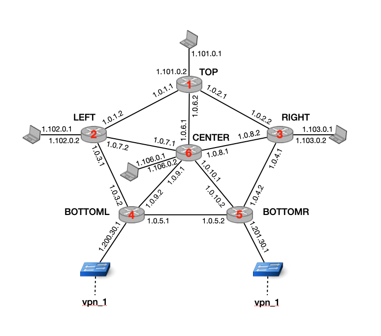

# IP Multicast

In this exercise, we will use the mini-Internet platform for IP multicast, and observe how the routers efficiently negotiate multicast trees on demand.

As a bonus task, we will stream an actual video using multicast in the mini-Internet!

## Introduction

The purpose of IP multicast can be summarized in two words: *Avoid broadcasting*.
Broadcasting, or flooding, means sending out an incoming packet on all other interfaces.
Broadcasting has issues related to both performance and security:
On the one hand, it wastes a lot of bandwidth and can easily overload networks, as packets get replicated many times.
On the other hand, packets get forwarded everywhere, even to destinations they were not intended for.

IP multicast attempts to mitigate these problems with two core mechanisms:
1.  Receivers (hosts) must explicitly join *multicast groups* to receive multicast messages (from the joined groups only).
    This is done with the [Internet Group Management Protocol (IGMP)][IGMP].

2.  Routers compute trees between a multicast source and all receivers, and only send packets along the links in this tree.
    This is done using [Protocol Independent Multicast (PIM)][PIM].

In this exercise, we will set up both IGMP and PIM for the topology shown below and observe the exchanged messages, and how the multicast trees are established.




[IGMP]: https://en.wikipedia.org/wiki/Internet_Group_Management_Protocol
[PIM]: https://en.wikipedia.org/wiki/Protocol_Independent_Multicast


## Setup

The setup for these exercises is, aside from the different topology, the same as for the [BGP VPN exercise](../BGP_VPN_MPLS/).
Have a look there if you need detailed setup instructions, but we'll give you a short summary below:

-   To create your mini-Internet, run `./build/build.sh`.
    The complete topology shown above will be set up, including all interface addresses, OSPF, and BGP. You do *not* need to configure any of this for this exercise.

- Tear down the mini-Internet with `./build/cleanup.sh`.

-   Once the mini-Internet is running, you can use the `./access.sh` script to enter a terminal on any of the devices, or run a command.

    ```
    # Enter a router, e.g. top. By default, this starts the FRR terminal.
    ./access.sh top

    # Start bash instead of the frr shell.
    ./access.sh top bash

    # Instead of a shell, run tcpdump.
    ./access.sh top tcpdump -n -i port_CENTER

    # Access a host. By default, this uses bash.
    ./access.sh top-host

    # You can also run commands like tcpdump on a host.
    ./access.sh top-host tcpdump -n -i TOProuter
    ```

-   You can use scripts to configure your routers (or hosts, but that's not necessary for this exercise), so you do not have to re-type all commands after restarting the mini-Internet.
    In the `config/` directory, we have prepared script skeletons for all routers.
    Add your commands there, and run `./config/configure.sh` to execute them.

- To save the running config of all routers, you can use `./config/save_configs.sh`.


## Your Task: Configure Multicast

You can configure multicast in two steps.

1. You need to set up PIM *within* the network, i.e. between the routers.
2. You need to set up IGMP *between* the routers and hosts, i.e. on the outgoing interfaces.

In the following, we will walk through the PIM and IGMP setup step-by-step.
In this README, we will tell you the necessary configuration steps, and you will need to find the actual configuration commands [in the FRR docs][FRRPIM].

Throughout this task, it will be insightful to watch the messages exchanged between routers, in particular once we get to the point where multicast trees are established.
To make your life easier, we have prepared a script for you that starts a `tcpdump` on every link (and formats the output so you can keep track).
We advise you to open a separate terminal and run the following command:

```
./dump_all.sh igmp or pim
```

This will capture only messages related to IGMP or PIM. Whenever you configure something, you can observe the message exchange.

[FRRPIM]: http://docs.frrouting.org/en/latest/pim.html


### Configure PIM

PIM is used between routers to establish multicast routing trees.
It is called (routing) *protocol independent*, as it is no routing protocol in itself.
Instead, it relies on the unicast routing tables.
As we have full connectivity already, we do not have to worry about this.
There are several variants of PIM ([more here][PIM]), and FRRouting implements *PIM Sparse Mode (PIM-SM)*, which we will focus on in the following.

Your first task is to activate multicast (i.e., PIM) on all router interfaces.
Currently, multicast is not active on any interface, and if you run the command `show ip pim interface`, you will see nothing. For example, on router `TOP`:

```
TOP_router# show ip pim interface
Interface         State          Address  PIM Nbrs           PIM DR  FHR IfChannels
```

Make sure to active PIM on *all* interfaces, even the interfaces towards the host -- otherwise the router will not allow multicast on this interface.
You can verify your solution by running `show ip pim interface` again. Here is the output for `TOP` after activating PIM for the `port_CENTER` in `TOP` and `port_TOP` in `CENTER`:

```
TOP_router# show ip pim interface
Interface         State          Address  PIM Nbrs           PIM DR  FHR IfChannels
pimreg               up          0.0.0.0         0            local    0          0
port_CENTER          up          1.0.6.2         1            local    0          0
```

The `pimreg` is an internal interface used by FRR. You can ignore it, and also do not need to manually configure anything for it.

In the `tcpdump`, you should also see `Hello` messages like this:

```
IP 1.0.6.1 > 224.0.0.13: PIMv2, Hello, length 34
IP 1.0.6.2 > 224.0.0.13: PIMv2, Hello, length 34
```

Notice that both routers are sending their messages to `224.0.0.13`, a special multicast address [reserved just for this purpose][addresses].

[addresses]: https://www.iana.org/assignments/multicast-addresses/multicast-addresses.xhtml

If you have enabled PIM on all interfaces, you can continue with configuring PIM-SM.
To establish multicast trees, PIM-SM requires one router to act as a *rendezvous point (rp)* for each multicast group.
Whenever a new source or a new receiver joins a multicast group, this `rp` coordinates the setup of new multicast trees.
You need to configure this `rp` on all routers.
You could pick any router as `rp`, but use the `CENTER` router for this exercise.
Additionally, for the range of multicast groups this `rp` is responsible for, pick `237.0.0.0/24`.

:information_source: As for BGP sessions, it's usually a good idea to use the loopback interface address for the `rp` (otherwise, the `rp` would be unavailable if the physical interface goes down, even if other paths to the router are still available).

You can verify the `rp` configuration using `show ip pim rp-info`. For example, compare the output of `TOP` and `CENTER`:

```
TOP_router# show ip pim rp-info
RP address       group/prefix-list   OIF         I am RP     Source
1.156.0.1        237.0.0.0/24        port_CENTER no          Static

CENTER_router# show ip pim rp-info
RP address       group/prefix-list   OIF         I am RP     Source
1.156.0.1        237.0.0.0/24        lo          yes         Static
```

However, at this point, there are no multicast groups established yet, nor are there multicast routes. Both `show ip pim state` and `show ip mroute` return nothing.

```
TOP_router# show ip pim state
Codes: J -> Pim Join, I -> IGMP Report, S -> Source, * -> Inherited from (*,G), V -> VxLAN
Installed Source           Group            IIF               OIL

TOP_router# show ip mroute
Source          Group           Proto  Input            Output           TTL  Uptime
```

### Configure IGMP

To allow any receivers (hosts) to join a multicast group, we require IGMP.
Thus, we need to activate IGMP on all *host-facing* interfaces.
Similar to PIM, we need to tell FRRouting to enable IGMP for specific interfaces.
As the routers themselves do not join any multicast groups, but rather establish the routing of multicast groups between hosts, you should *not* enable IGMP on interfaces between routers.

You can check the IGMP interface status using `show ip igmp interface`.
Before you configure IGMP, you should see something like this:

```
TOP_router# show ip igmp interface
Interface         State          Address  V  Querier  Query Timer    Uptime
host               mtrc        1.101.0.2  3    other     --:--:--  00:00:15
lo                 mtrc        1.151.0.1  3    other     --:--:--  00:00:15
port_CENTER        mtrc          1.0.6.2  3    other     --:--:--  00:00:15
port_LEFT          mtrc          1.0.1.1  3    other     --:--:--  00:00:15
port_RIGHT         mtrc          1.0.2.1  3    other     --:--:--  00:00:15
```

Even if you have not set up IGMP itself, you can see the PIM interfaces, you can recognize them by the `mtrc` state.
After you have configured IGMP for the host interface, you can see it in the list of IGMP interfaces:

```
TOP_router# show ip igmp interface
Interface         State          Address  V  Querier  Query Timer    Uptime
host                 up        1.101.0.2  3    local     00:00:27  00:00:05
lo                 mtrc        1.151.0.1  3    other     --:--:--  00:00:05
port_CENTER        mtrc          1.0.6.2  3    other     --:--:--  00:00:05
port_LEFT          mtrc          1.0.1.1  3    other     --:--:--  00:00:05
port_RIGHT         mtrc          1.0.2.1  3    other     --:--:--  00:00:05
```

:information_source: The switch interfaces on `BOTTOML` and `BOTTOMR` are not called `host`.
Make sure to use the right names.

### Join a multicast group

Finally, it's time to establish multicast groups and observe how PIM-SM builds multicast trees.
In PIM-SM, only receivers actively join a multicast group.
When a host joins a multicast group, the router informs the `rp` via PIM.
On the other hand, sources can just start sending. As soon as the first data packets arrive at a PIM router, it also forwards them to the `rp` to actually establish multicast routes to receivers.

Below, we'll first join a multicast group on `RIGHT-host`, start sending traffic from `TOP-host`, and observe how the multicast routes are set up.

:information_source: If there is a source, but no receivers, the `rp` simply tells the router to drop the multicast traffic, at least until a receiver joins.

To follow the PIM messages, you might want to exclude the `Hello` messages exchanged between routers. You can do this with grep:

```
./dump_all.sh pim | grep -v Hello
```

In contrast to unicast, there are no static multicast routes. (Can you imagine why?)
For this reason, we cannot simply install forwarding rules in the hosts and be done with it, we need some program to handle the multicast group membership.
One such program is `smcroute`, which we automatically start on each host during the setup of this exercise.

You can use the following commands to join and leave groups ([more info][SMC]):

[SMC]: https://manpages.debian.org/jessie/smcroute/smcroute.8

```
# Join a group
smcroute -j interface group
# Leave a group
smcroute -l interface group
```

The `group` is a concrete multicast address or address range.

Join the group `237.0.0.10` on `RIGHT-host`.
Make sure to use the router interface for joining.

:information_source: On the hosts, you can always use commands such as `ip link` or `ifconfig` to get interface information.

After you have joined the group, you will now see entries in the routers, e.g. on `RIGHT`:

```
RIGHT_router# show ip pim state
Codes: J -> Pim Join, I -> IGMP Report, S -> Source, * -> Inherited from (*,G), V -> VxLAN
Installed Source           Group            IIF               OIL
1         *                237.0.0.10       port_CENTER       pimreg(I   ), host(IJ  )

RIGHT_router# show ip mroute
Source          Group           Proto  Input            Output           TTL  Uptime
*               237.0.0.10      IGMP   port_CENTER      pimreg           1    00:01:15
                                IGMP                    host             1    00:01:15
```

You can see the so called `(*, G)` tree, or PIM Shared Tree, recognizable by the source `*`.
This is the multicast tree rooted at the `rp`. PIM messages for this group are sent along this tree.

Next, let's send some traffic from `top-host`.

**IMPORTANT:** You *must* set the TTL to a high-enough value manually, e.g. `10` for our network. By default, multicast packets are sent with `ttl=1` to avoid broadcasts in badly configured networks.

```
root@TOP_host:/# ping -t10 237.0.0.10
```

You should receive responses from `1.103.0.1`, i.e. `RIGHT-host`.
It may take a few seconds until the first responses arrive -- PIM can be a bit slow.

In the `tcpdump` output, you should observe PIM `Register` and `Join / Prune` messages.
Before we take a closer look at the messages, have a look at the PIM state and multicast routes, e.g. at `RIGHT`:

```
RIGHT_router# show ip pim state
Codes: J -> Pim Join, I -> IGMP Report, S -> Source, * -> Inherited from (*,G), V -> VxLAN
Installed Source           Group            IIF               OIL
1         *                237.0.0.10       port_CENTER       pimreg(I   ), host(IJ  )
1         1.101.0.1        237.0.0.10       port_TOP          host(   *)

RIGHT_router# show ip mroute
Source          Group           Proto  Input            Output           TTL  Uptime
*               237.0.0.10      IGMP   port_CENTER      pimreg           1    00:03:24
                                IGMP                    host             1    00:03:24
1.101.0.1       237.0.0.10      STAR   port_TOP         host             1    00:03:19
```

Now that we have *both* a source and receiver, you can see that a new multicast tree has been computed, the `(S, G)` tree or *PIM Shortest Path Tree*.
As the name implies, this is the tree of shortest paths from the source (in this case `TOP-host`) to all receivers (here only `RIGHT-host`).
Check `ip pim state` on other routers, such as `CENTER` or `BOTTOML`.
You will notice that `CENTER` knows about the tree (as it's the `rp`), but is not part of it (there is no outgoing interface), while `BOTTOML` has not even learned anything about the tree.

Let's get back to the PIM messages in your `tcpdump` output to understand how this `(S, G)` tree is established.
You should see similar messages to the ones below.
Note that they are not necessarily in that order, as there can be some delays in the `tcpdump` processing.

```
center   <> top     IP 1.101.0.2 > 1.156.0.1: PIMv2, Register, length 92
center   <> top     IP 1.0.6.1 > 224.0.0.13: PIMv2, Join / Prune, length 34
center   <> top     IP 1.101.0.2 > 1.156.0.1: PIMv2, Register, length 92
center   <> top     IP 1.156.0.1 > 1.101.0.2: PIMv2, Register Stop, length 18
```

When router `TOP` receives the first multicast packet, it encapsulates this data in a (unicast) PIM `Register` message and sends it to the `rp` (`1.101.0.2` to `1.156.0.1`).
The `rp` then does the following:
- Compute an `(S, G)` route (not yet the `(S, G)` tree -- we'll get to that below).
- Send a PIM `Join` message for this `(S, G)` route to the first router, i.e. `TOP`.
- Forward the multicast data to all receivers along the `(*, G)` tree.


As soon as `TOP` receives the `Join`, it starts forwarding further multicast packets along the received `(S, G)` route.
Observe that `TOP` *keeps* sending `Register` messages to the `rp`, until the `rp` sends a `Register Stop` message, indicating that there is nothing else to register.

:information_source: If there is no receiver, the `rp` will immediately send a `Register Stop`.

In the following, you can observe messages similar to the ones below.

```
top      <> right   IP 1.0.2.2 > 224.0.0.13: PIMv2, Join / Prune, length 34
center   <> right   IP 1.0.8.2 > 224.0.0.13: PIMv2, Join / Prune, length 42
top      <> right   IP 1.0.2.2 > 224.0.0.13: PIMv2, Join / Prune, length 34
```

As soon as the destination routers (only `RIGHT` in this case) receive the first multicast packets, they start to establish the `(S, G)` tree by finding the shortest routes towards the source router (`TOP` here).
PIM achieves this using *reverse path forwarding*, and we'll quickly explain it below.
Reverse-path forwarding assumes that paths are symmetrical, i.e., that the best way for `TOP` to reach `RIGHT` is the reverse path for `RIGHT` to reach `TOP`.
Consequently, we can find the `(S, G)` tree if all destination routers send a message to the source router, and the source router then forwards subsequent packets on the same path(s) in reverse.
Concretely, `RIGHT` sends a `Join` message to the source router (`Top`) and as soon as `TOP` receives this `Join` on any interface, it uses the same interface to forward the traffic towards `RIGHT`, i.e. along the `(S, G)` tree.

Finally, when `RIGHT` receives the first multicast packet along this shortest-path tree (on the interface it used for the `Join` to `TOP`) it sends `Prune` messages to all other routers.
This tells them to only use the `(S, G)` tree from now on, and not forward multicast traffic over the `(*, G)` tree or the initial `(S, G)` route anymore.

Now, you could join the group on other hosts as well.
Join the same multicast group (`237.0.0.10`) on `LEFT-host`.
After a short moment, you should now notice that the pings sent from `TOP` will receive duplicate replies (`(DUP!)`) -- both `LEFT-host` and `RIGHT-host` are responding now!

If you look at the PIM state and multicast routes on `TOP`, you will now see both `LEFT` and `RIGHT` in the outgoing interface list (`OIL`) and output interfaces respectively:

```
TOP_router# show ip pim state
Codes: J -> Pim Join, I -> IGMP Report, S -> Source, * -> Inherited from (*,G), V -> VxLAN
Installed Source           Group            IIF               OIL
1         1.101.0.1        237.0.0.10       host              port_LEFT( J  ), port_RIGHT( J  )

TOP_router# show ip mroute
Source          Group           Proto  Input            Output           TTL  Uptime
1.101.0.1       237.0.0.10      PIM    host             port_LEFT        1    00:03:09
                                PIM                     port_RIGHT       1    00:03:09
```


## Bonus: Streaming a Real Video

Now, we can use the mini-Internet to stream an actual video to ourselves using multicast.
For this, we will be using the open source media player [VLC][vlc].

:information_source: Unfortunately, this will not work on Windows without a bit of hassle. You need to be able to use X forwarding. You need to install an X Server for this to work. One option is [Cygwin/X](https://x.cygwin.com).
We have not tried it ourselves, but [this thread on stackoverflow][xonwin] might help you to get set up.
On Mac and Linux, you should usually already have X installed and can proceed.
If you have access to a Unix machine, prefer to use it for this bonus task!


[xonwin]: https://superuser.com/questions/1332709/setting-up-x11-forwarding-over-ssh-on-windows-10-subsystem-for-linux


### Starting the stream

We have already installed VLC on `TOP-host` to act as our streaming source.
In the `build` directory, you will also find a folder `videos`, with a small test clip.
You can start the stream with the following command, e.g. for the video `eth.mp4`:

```
./access.sh top-host ./home/videos/start-stream.sh eth.mp4
```

Under the hood, this will start streaming the video to `rtp://237.0.0.10:1234`, which we will listen to later.


:information_source: If you want to try out other videos, put them in this folder and re-build the mini-Internet.

### Receiving the stream

To connect ourselves to the mini-Internet, we are going to use [OpenVPN][vpn].
As soon as you build the mini-Internet, you'll see a `vpn` folder pop up, containing all required credentials.

For simplicity, we will start the VPN on your VM (but outside the mini-Internet) and then start VLC to receive the stream from `TOP-host`.
However, we need to forward graphical output from the VM to your local machine, otherwise you won't be able to see anything.

Open two terminals.

1.  In the first terminal, we will connect the VM to the inside of the mini-Internet using a VPN.
    We provide a script for you to achieve this. On the VM, navigate into the `vpn` folder created by the build scripts, and run:

    ```
    ./connect.sh
    ```

    This will create a new interface `tap0`, which we can use to send and receive traffic from the mini-Internet.

2.  In the second terminal, we will run VLC. Here, we need to make sure that we can actually display the graphical output.
    We will leverage a feature called *X forwarding* of SSH.
    Open a *new* SSH connection with the `-X` flag.
    For example, if your ssh config entry for the VM is `vm-advnet`, connect like this:
    ```
    ssh -X vm-advnet
    ```

    Now, use *this* terminal to watch the stream. You need to specify the `tap0` interface as well as our multicast address.

    ```
    vlc --miface tap0
    ```

    **Important**: We can only transfer graphical output using X Forwarding, not audio (this requires extra setup). To avoid getting swamped with errors, set the `Audio > Audio Device` to *Discard all samples* before you continue.

    Finally, open the network stream. Go to `Media > Open Network Stream` and enter `rtp://237.0.0.10:1234`. The video should start after a few seconds. Enjoy!

[vlc]: https://www.videolan.org/vlc/index.html
[vpn]: https://en.wikipedia.org/wiki/OpenVPN
[wsl]: https://docs.microsoft.com/en-us/windows/wsl/