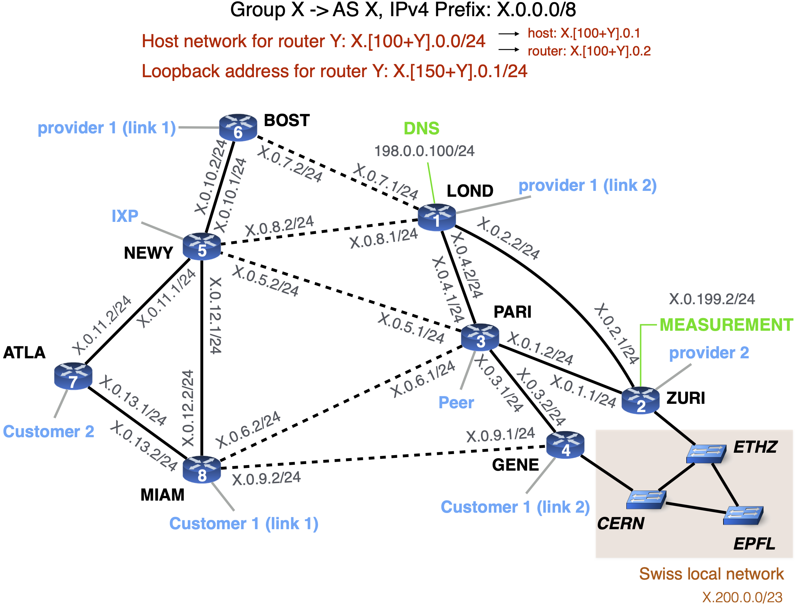
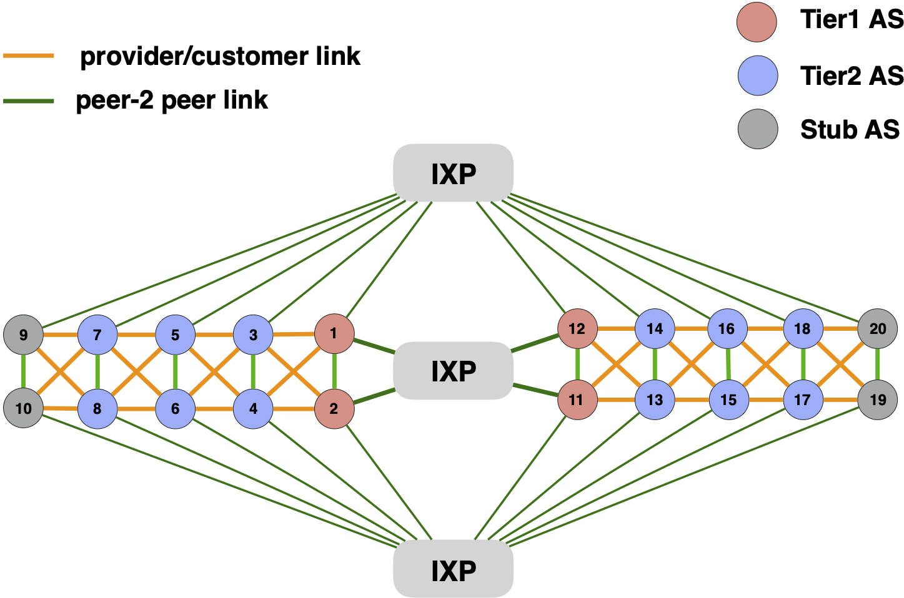

# The mini-Internet topology

This directory contains the configuration files which define the topology used when building the mini-Internet (by default the topology is the one we  used in 2020).
The files `layer2_hosts_config.txt`, `layer2_switches_config.txt` and `layer2_links_config.txt` define the L2 topology in transit ASes.
The L2 topology we used for transit ASes is the following one:

The files `layer2_hosts_config_empty.txt`, `layer2_switches_config_empty.txt` and `layer2_links_config_empty.txt` define the L2 topology in the Tier1 and Stub ASes. They are empty, meaning that Tier1 and Stub ASes do not have a L2 network.

The files `router_config_full.txt` and `internal_links_config_full.txt` define the L3 topology in transit ASes.
The L3 topology and the IP address allocation scheme for transit ASes is depicted in the figure below.

The files `router_config_small.txt` and `internal_links_config_small.txt` define the L3 topology in Tier1 and Stub ASes.
For these ASes, the L3 topology only contains two routers.

Finally, by default a mini-Internet with 20 ASes is built. The figure below depicts the AS-level topology. There are Tier1 ASes, transit ASes, Stub ASes, as well as IXPs. ASes and IXPs are interconnected via peer-2-peer links or provider/customer links.

